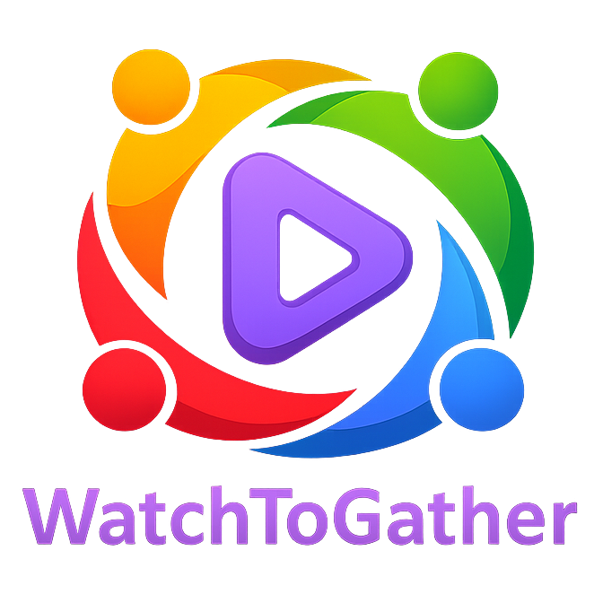

<p align="center">
    
</p>

---

<p align="center">
  Sync video playback with friends on any website.
</p>

## Overview

WatchToGather is a browser extension that enables a shared watching experience by synchronizing the **browser tab state** across multiple users.

When watching videos together, **playback controls** (play, pause, seek) and **URL navigation** (such as changing episodes or videos) are kept in sync for everyone in the room. This makes it feel like everyone is watching from the same browser tab, even though each user is on their own device.

WatchToGather is designed to work with most video websites, though compatibility may vary depending on how a site implements playback and navigation. It uses peer-to-peer (P2P) connections to coordinate state between participants, without hosting or streaming any video content.

## Features

- Synchronized playback controls (play, pause, seek)
- Synchronized URL navigation (episode changes, next video)
- Designed to work on most video websites
- Shared "watch room" experience across multiple devices
- Peer-to-peer state synchronization
- No video hosting or streaming

## How It Works

1. A host creates a watch room providing an initial video URL and shares the room ID
2. Participants join the room using the room ID and receive the URL
3. Users visit the URL and registers their current active tab
4. Browser tab state (playback actions and URL changes) is synchronized across all users
5. Everyone watches together as if controlling a shared tab

## Development

```bash
npm install
npm run build
```

## Contributing

Contributions are welcome!

If you have an idea for a new feature, improvement, or optimization:

- Open an issue to discuss it
- Or submit a pull request directly

Please try to keep changes focused and well-documented. Bug fixes, performance improvements, and compatibility enhancements are especially appreciated.

The signalling server is intentionally minimal and not a primary focus of this project. Please open an issue before proposing changes to server-side code.

## Disclaimer

WatchToGather is an independent, open-source project.

This extension does not host, stream, copy, or distribute any video content. It only provides synchronized playback controls for media that users already have access to on third-party websites.

All video content remains the property of its respective owners and platforms.  
Users are responsible for ensuring their use of this extension complies with the Terms of Service of any website they use it on.

## Acknowledgements

Thanks to **[@horouuu](https://github.com/horouuu)** for providing access to their homelab infrastructure to host the signaling server.

## License

This project is licensed under the [MIT License](LICENSE).
